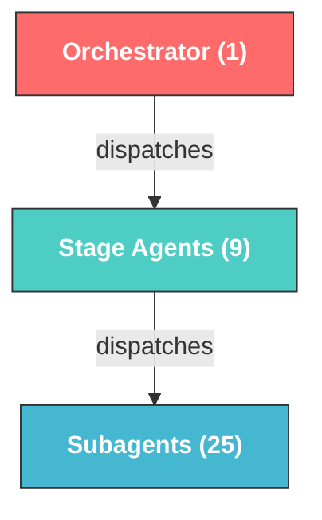
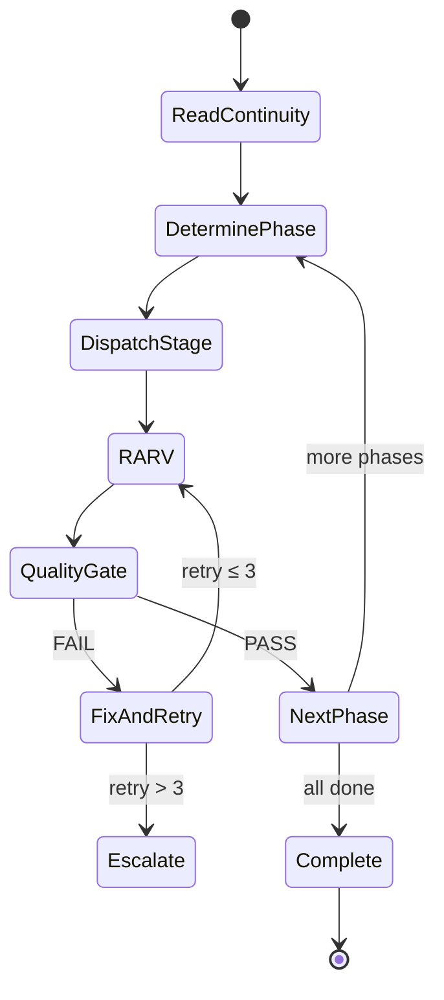
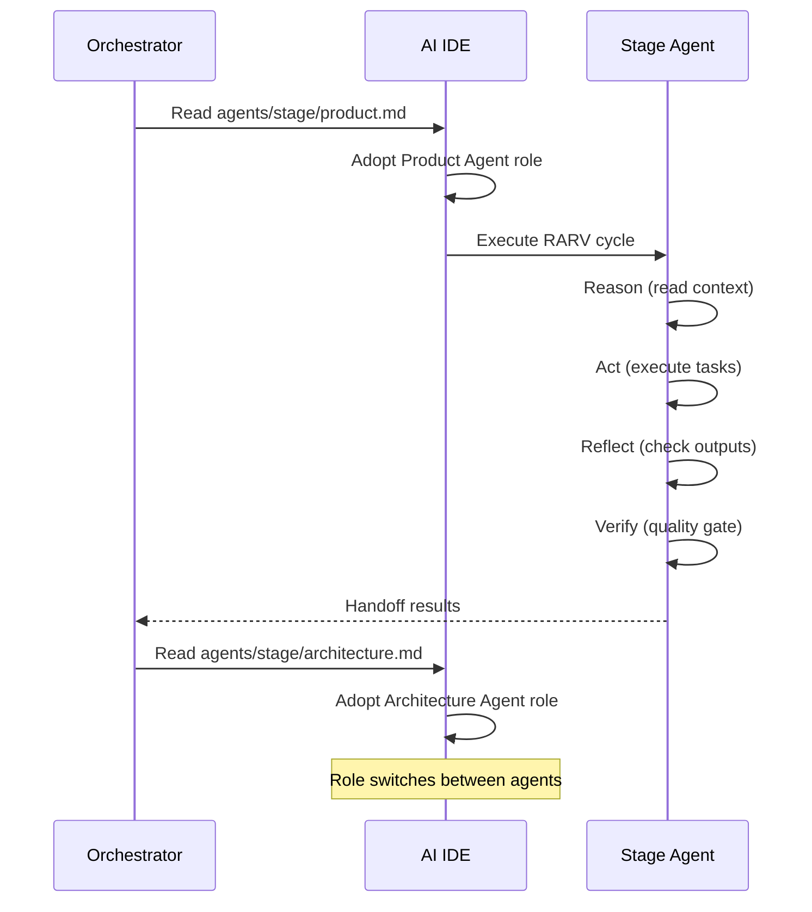
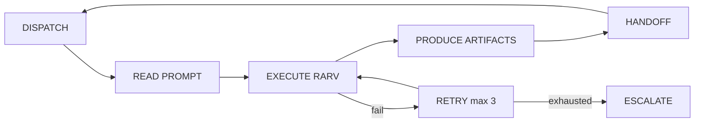

# Agents

## Overview

The framework has **35 agents** in a 3-tier hierarchy: 1 orchestrator, 9 stage agents, and 25 subagents. Every agent is a `.md` file under `.sdlc/framework/agents/`.



## Agent Prompt Structure

Every agent prompt follows this standard format:

```markdown
## GOAL
[What success looks like — measurable outcome]

## CONSTRAINTS
[Hard limits — what you cannot do]

## CONTEXT
[Files to read, previous attempts, related decisions]

## OUTPUT
[Exact deliverables expected — file paths, formats]
```

## Orchestrator

| Field | Value |
|-------|-------|
| **ID** | `orch-sdlc` |
| **File** | `.sdlc/framework/agents/orchestrator.md` |
| **Role** | Workflow control, phase transitions, task delegation, quality gate enforcement |
| **Dispatches** | All 9 stage agents sequentially |

The orchestrator:
- Reads `AGENTS.md` to discover available agents
- Reads `CONTINUITY.md` at the start of every turn
- Drives the RARV cycle (Reason → Act → Reflect → Verify)
- Enforces quality gates between phases
- Manages error handling and retry logic



## Stage Agents

| # | Agent | ID | File | Subagents |
|---|-------|----|------|-----------|
| 1 | Product | `stage-product` | `agents/stage/product.md` | 4 |
| 2 | Architecture | `stage-architecture` | `agents/stage/architecture.md` | 4 |
| 3 | Backlog | `stage-backlog` | `agents/stage/backlog.md` | 0 |
| 4 | Development | `stage-development` | `agents/stage/development.md` | 4 |
| 5 | Testing | `stage-testing` | `agents/stage/testing.md` | 4 |
| 6 | Security | `stage-security` | `agents/stage/security.md` | 4 |
| 7 | Review | `stage-review` | `agents/stage/review.md` | 3 |
| 8 | DevOps | `stage-devops` | `agents/stage/devops.md` | 0 |
| 9 | Observability | `stage-observability` | `agents/stage/observability.md` | 0 |

## Subagents by Stage

### Product Subagents (4)

| Agent | ID | File | Task |
|-------|----|------|------|
| Requirement Parser | `sub-requirement-parser` | `agents/sub/product/requirement-parser.md` | Parse raw input into structured requirements |
| Acceptance Criteria Generator | `sub-acceptance-criteria` | `agents/sub/product/acceptance-criteria-generator.md` | Generate testable Given/When/Then criteria |
| Risk Analyzer | `sub-risk-analyzer` | `agents/sub/product/risk-analyzer.md` | Identify risks with severity and mitigations |
| Assumption Extractor | `sub-assumption-extractor` | `agents/sub/product/assumption-extractor.md` | Surface hidden assumptions in specs |

### Architecture Subagents (4)

| Agent | ID | File | Task |
|-------|----|------|------|
| API Designer | `sub-api-designer` | `agents/sub/architecture/api-designer.md` | Design REST/GraphQL APIs (OpenAPI 3.x) |
| Data Model Designer | `sub-data-model-designer` | `agents/sub/architecture/data-model-designer.md` | Database schemas, ERDs, migrations |
| Integration Planner | `sub-integration-planner` | `agents/sub/architecture/integration-planner.md` | External system integrations |
| NFR Evaluator | `sub-nfr-evaluator` | `agents/sub/architecture/nfr-evaluator.md` | Non-functional requirements evaluation |

### Development Subagents (4)

| Agent | ID | File | Task |
|-------|----|------|------|
| Repo Analyzer | `sub-repo-analyzer` | `agents/sub/development/repo-analyzer.md` | Analyze codebase patterns and conventions |
| Code Generator | `sub-code-generator` | `agents/sub/development/code-generator.md` | Implement features from task definitions |
| Refactoring Agent | `sub-refactoring-agent` | `agents/sub/development/refactoring-agent.md` | Refactor for quality and maintainability |
| Documentation Agent | `sub-documentation-agent` | `agents/sub/development/documentation-agent.md` | Generate code and API documentation |

### Testing Subagents (4)

| Agent | ID | File | Task |
|-------|----|------|------|
| Unit Test Agent | `sub-unit-test` | `agents/sub/testing/unit-test-agent.md` | Unit tests with ≥80% coverage target |
| Integration Test Agent | `sub-integration-test` | `agents/sub/testing/integration-test-agent.md` | Component interaction tests |
| Regression Test Agent | `sub-regression-test` | `agents/sub/testing/regression-test-agent.md` | Map acceptance criteria to regression tests |
| Test Data Generator | `sub-test-data` | `agents/sub/testing/test-data-generator.md` | Fixtures, mocks, factory functions |

### Security Subagents (4)

| Agent | ID | File | Task |
|-------|----|------|------|
| Secret Scanner | `sub-secret-scanner` | `agents/sub/security/secret-scanner.md` | Detect hardcoded secrets, API keys, tokens |
| Dependency Scanner | `sub-dependency-scanner` | `agents/sub/security/dependency-scanner.md` | Audit dependencies for CVEs |
| OWASP Reviewer | `sub-owasp-reviewer` | `agents/sub/security/owasp-reviewer.md` | OWASP Top 10 review |
| Policy Validator | `sub-policy-validator` | `agents/sub/security/policy-validator.md` | Security policy compliance |

### Review Subagents (3)

| Agent | ID | File | Task |
|-------|----|------|------|
| Code Review Agent | `sub-code-review` | `agents/sub/review/code-review-agent.md` | Code quality, SOLID, best practices |
| Maintainability Reviewer | `sub-maintainability` | `agents/sub/review/maintainability-reviewer.md` | Tech debt, complexity, readability |
| Performance Reviewer | `sub-performance` | `agents/sub/review/performance-reviewer.md` | Bottlenecks, optimization opportunities |

## Agent Execution Model

Agents execute via **role switching** — the AI IDE reads the agent's `.md` prompt and adopts that persona:



## Agent Lifecycle



## Complexity-Based Selection

Not all subagents run for every project:

| Complexity | Detection | Subagents Used |
|------------|-----------|----------------|
| **Simple** | < 5 requirements, single service | Parser + Code Generator + Unit Test |
| **Medium** | 5–15 requirements, 2–3 services | Core subagents per stage |
| **Complex** | 15–50 requirements, microservices | All subagents |
| **Enterprise** | 50+ requirements, distributed | All subagents + extended review |

## Handoff Protocol

When one agent passes work to another:

```json
{
  "from": "stage-product",
  "to": "stage-architecture",
  "phase": "product → architecture",
  "completed_work": "Requirements parsed, acceptance criteria generated",
  "artifacts_produced": [
    ".sdlc/artifacts/product/requirements.md",
    ".sdlc/artifacts/product/acceptance-criteria.md"
  ],
  "decisions_made": ["REST over GraphQL", "PostgreSQL for persistence"],
  "open_questions": [],
  "mistakes_learned": []
}
```
