# CLI Reference

## Installation

```bash
# One-time (no install)
uvx --from git+https://github.com/bitbitcodes/autonomous-sdlc.git sdlc init .

# Persistent install
pip install git+https://github.com/bitbitcodes/autonomous-sdlc.git

# Development install
git clone https://github.com/bitbitcodes/autonomous-sdlc.git
cd autonomous-sdlc
pip install -e ".[test,dev]"
```

**Requirements:** Python 3.11+

## Commands

### `sdlc init`

Initialize the autonomous-sdlc agent framework in a directory.

```bash
sdlc init [TARGET] [OPTIONS]
```

**Arguments:**

| Argument | Description | Default |
|----------|-------------|---------|
| `TARGET` | Target directory path | Current directory |

**Options:**

| Flag | Short | Description | Default |
|------|-------|-------------|---------|
| `--integration` | `-i` | AI IDE integration key | (interactive) |
| `--project-name` | `--name` | Project name for templates | Directory name |
| `--tech-stack` | | Tech stack context | (empty) |
| `--team-size` | | Team size context | (empty) |
| `--force` | `-f` | Overwrite existing files | `false` |
| `--non-interactive` | `-y` | Skip prompts, use defaults | `false` |
| `--here` | | Init in current directory | `false` |

**Integration keys:**

| Key | IDE |
|-----|-----|
| `copilot` | GitHub Copilot |
| `windsurf` | Windsurf |
| `claude` | Claude Code |
| `cursor-agent` | Cursor |
| `opencode` | opencode |
| `gemini` | Gemini CLI |
| `codex` | Codex CLI |
| `amp` | Amp |
| `kilocode` | Kilo Code |

**Examples:**

```bash
# Interactive mode (default)
sdlc init .

# Non-interactive with all options
sdlc init . \
  --integration windsurf \
  --project-name "Task API" \
  --tech-stack "Python, FastAPI, PostgreSQL" \
  --team-size "3 developers" \
  --non-interactive

# Force overwrite existing
sdlc init . --force --integration copilot -y

# Init in current directory
sdlc init --here
```

### `sdlc version`

Print the installed version.

```bash
sdlc version
# autonomous-sdlc 1.1.0
```

## Scaffold Behavior

### What Gets Created

```mermaid
flowchart TD
    INIT["sdlc init ."] --> FW["Copy framework files"]
    INIT --> RT["Create runtime dirs"]
    INIT --> STATE["Init state files"]
    INIT --> AGENTS_MD["Install AGENTS.md"]
    INIT --> IDE["Setup IDE integration"]
    INIT --> GIT["Update .gitignore"]
    INIT --> CFG["Save init-options.json"]

    FW --> FW1[".sdlc/framework/agents/"]
    FW --> FW2[".sdlc/framework/references/"]
    FW --> FW3[".sdlc/framework/skills/"]
    FW --> FW4[".sdlc/framework/templates/"]
    FW --> FW5[".sdlc/framework/examples/"]
    FW --> FW6[".sdlc/framework/run.sh"]

    RT --> RT1[".sdlc/state/"]
    RT --> RT2[".sdlc/queue/"]
    RT --> RT3[".sdlc/memory/"]
    RT --> RT4[".sdlc/artifacts/"]
    RT --> RT5[".sdlc/specs/"]

    STATE --> ST1["orchestrator.json"]
    STATE --> ST2["queue/{pending,active,completed}.json"]
    STATE --> ST3["memory indexes"]
    STATE --> ST4["CONTINUITY.md"]
```



### Framework Files (committed)

These are copied from the installed package into `.sdlc/framework/`:

| Directory | Contents |
|-----------|----------|
| `agents/` | 35 agent prompt files (orchestrator + 9 stage + 25 sub) |
| `references/` | 5 reference docs (workflow, phases, agents, memory, quality) |
| `skills/` | 5 skill modules (prompting, dispatch, gates, testing, memory) |
| `templates/` | 3 agent templates (stage, subagent, handoff) |
| `examples/` | 4 sample specs (PRD, YAML, brief, JIRA epic) |
| `run.sh` | Utility runner script |

### Runtime Files (gitignored)

Created under `.sdlc/` and added to `.gitignore`:

| Path | Purpose |
|------|---------|
| `state/orchestrator.json` | Phase progress tracking |
| `queue/{pending,active,completed}.json` | Task lifecycle |
| `memory/episodic/` | Per-task execution traces |
| `memory/semantic/` | Patterns and anti-patterns |
| `memory/learnings/` | Error-driven learning |
| `artifacts/<phase>/` | Generated outputs per phase |
| `specs/` | Normalized input specifications |
| `CONTINUITY.md` | Working memory |

### IDE Config Files

Placed at each IDE's native location:

| IDE | Files Created |
|-----|--------------|
| Windsurf | `.windsurf/rules/sdlc.md`, `.windsurf/workflows/sdlc.orchestrator.md` |
| Copilot | `.github/copilot-instructions.md`, `.github/agents/sdlc.orchestrator.md` |
| Claude Code | `CLAUDE.md`, `.claude/commands/sdlc-orchestrator.md` |
| Cursor | `.cursor/rules/sdlc.mdc` |
| opencode | `.opencode/instructions.md`, `.opencode/commands/sdlc-orchestrator.md` |
| Gemini | `.gemini/GEMINI.md`, `.gemini/commands/sdlc-orchestrator.md` |
| Codex | `.codex/instructions.md`, `.codex/commands/sdlc-orchestrator.md` |
| Amp | `.amp/instructions.md`, `.amp/commands/sdlc-orchestrator.md` |
| Kilo Code | `.kilocode/instructions.md`, `.kilocode/commands/sdlc-orchestrator.md` |

## run.sh Utility

After init, use `.sdlc/framework/run.sh` to manage the framework:

```bash
# Start with a spec
.sdlc/framework/run.sh start ./your-prd.md
.sdlc/framework/run.sh start "Build a REST API for task management"

# Check status
.sdlc/framework/run.sh status

# Reset state (keeps framework files)
.sdlc/framework/run.sh reset
```

## Configuration

Saved in `.sdlc/init-options.json`:

```json
{
  "projectName": "My API",
  "integration": "windsurf",
  "techStack": "Python, FastAPI, PostgreSQL",
  "teamSize": "3 developers",
  "complexity": "auto"
}
```

## Package Structure

The Python CLI is built with:
- **typer** — CLI framework
- **rich** — Terminal formatting (tables, status spinners, colors)
- **readchar** — Arrow-key interactive selector
- **hatchling** — Build backend

```
src/sdlc_cli/
├── __init__.py        # Typer app, init command
├── scaffold.py        # Core scaffold logic
├── banner.py          # ASCII art banner
├── config.py          # Config persistence
├── version.py         # Version string
├── selector.py        # Interactive IDE picker
└── integrations/      # IDE integration registry
    ├── __init__.py    # @register decorator
    ├── base.py        # IntegrationBase, MarkdownIntegration
    └── <ide>/         # One subpackage per IDE
```
