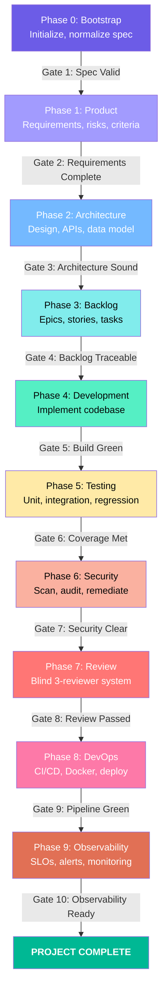
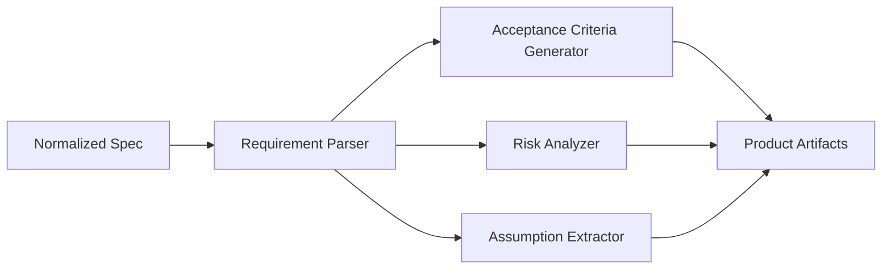
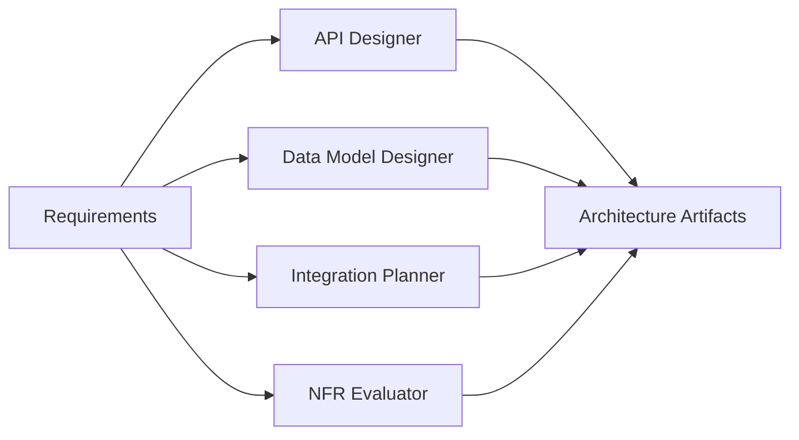
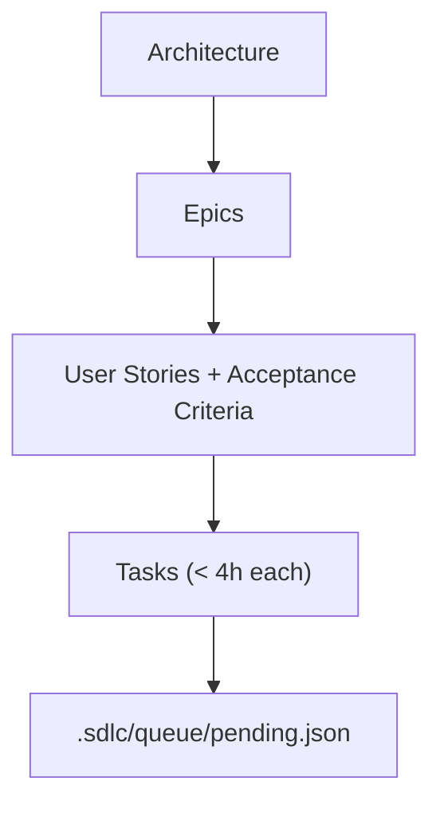
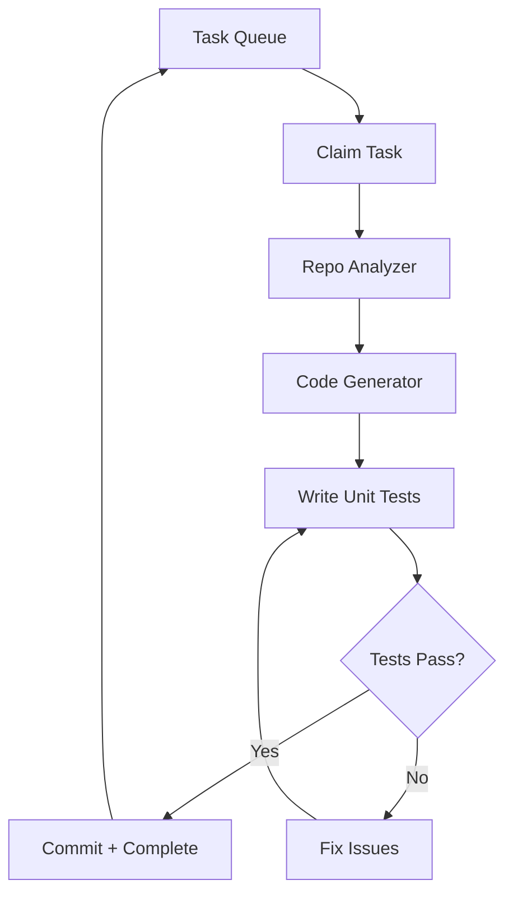
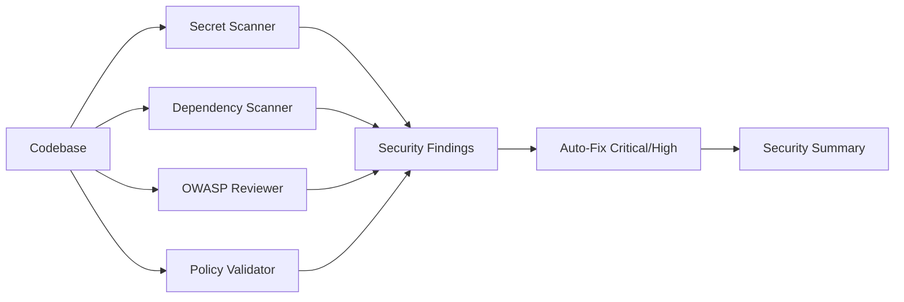
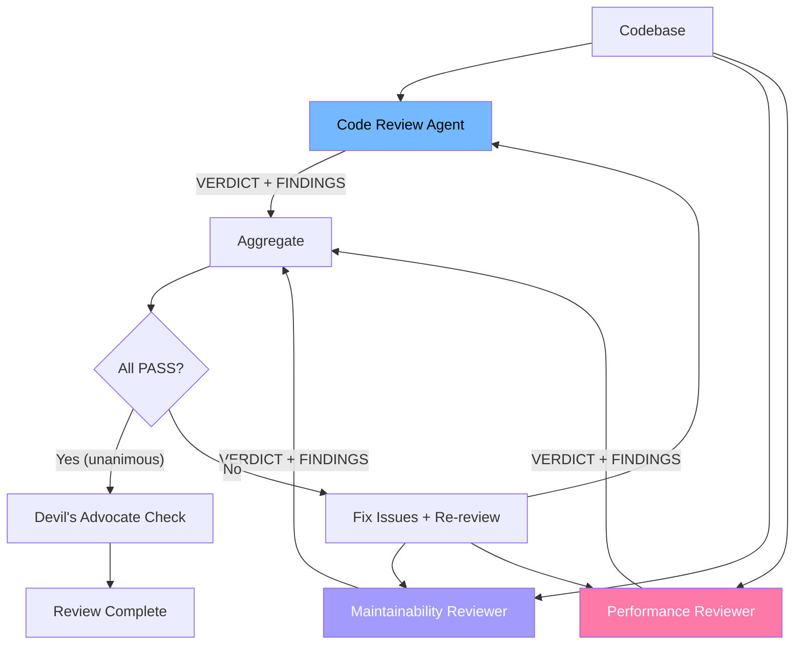
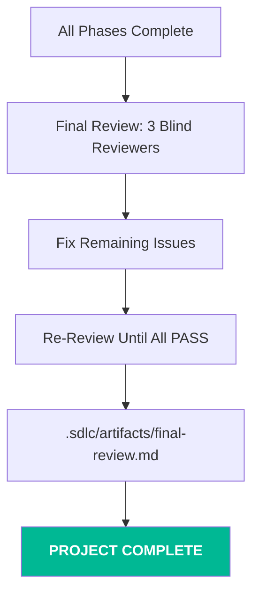

# SDLC Phases

## Phase Pipeline

The framework executes 10 sequential phases, each with a quality gate:

## Phase 0: Bootstrap

**Purpose:** Initialize the framework and normalize the input spec.

**Agent:** Orchestrator (direct — no stage agent)

**Actions:**
1. Create `.sdlc/` directory structure
2. Parse and normalize input spec (PRD, YAML, brief, issue)
3. Store normalized spec in `.sdlc/specs/normalized-spec.md`
4. Detect project complexity (simple / medium / complex / enterprise)
5. Select agent team based on complexity
6. Initialize `CONTINUITY.md` and `orchestrator.json`

**Gate 1 — Spec Valid:** Input spec is parseable, non-empty, contains actionable requirements.

## Phase 1: Product Discovery

**Purpose:** Analyze requirements, identify risks, generate acceptance criteria.

**Agent:** `stage-product` with 4 subagents

**Artifacts:**
| File | Content |
|------|---------|
| `artifacts/product/requirements.md` | Structured requirements (functional + NFR) |
| `artifacts/product/acceptance-criteria.md` | Given/When/Then criteria per feature |
| `artifacts/product/risks.md` | Risk register with severity and mitigations |
| `artifacts/product/assumptions.md` | Hidden assumptions flagged for validation |

**Gate 2 — Requirements Complete:** All requirements have IDs, acceptance criteria, and risk assessment.

## Phase 2: Architecture

**Purpose:** Design system architecture, API contracts, data models.

**Agent:** `stage-architecture` with 4 subagents

**Artifacts:**
| File | Content |
|------|---------|
| `artifacts/architecture/system-design.md` | Architecture overview, component diagram |
| `artifacts/architecture/api-contracts.yaml` | OpenAPI 3.x specification |
| `artifacts/architecture/data-model.md` | Database schema, ERD, relationships |
| `artifacts/architecture/integrations.md` | External system integration plan |
| `artifacts/architecture/nfr-assessment.md` | NFR evaluation with target metrics |
| `artifacts/architecture/adrs/` | Architecture Decision Records |

**Gate 3 — Architecture Sound:** API contracts are valid OpenAPI, data model is normalized, NFRs have measurable targets.

## Phase 3: Backlog

**Purpose:** Decompose architecture into implementable work items.

**Agent:** `stage-backlog` (no subagents)

**Artifacts:**
| File | Content |
|------|---------|
| `artifacts/backlog/epics.md` | Epic definitions |
| `artifacts/backlog/stories.md` | User stories with criteria |
| `artifacts/backlog/tasks.json` | Task list with dependencies |
| `queue/pending.json` | Populated task queue |

**Gate 4 — Backlog Traceable:** Every story traces to a requirement. No circular dependencies.

## Phase 4: Development

**Purpose:** Implement the codebase task by task.

**Agent:** `stage-development` with 4 subagents

**Per-task workflow:**
1. Claim from `queue/pending.json` → move to `queue/active.json`
2. Read task definition + architecture docs
3. Implement following existing patterns (repo analyzer)
4. Write unit tests alongside implementation
5. Run tests until passing
6. Commit checkpoint
7. Move to `queue/completed.json`

**Gate 5 — Build Green:** Zero build errors, zero lint errors, all unit tests pass.

## Phase 5: Testing

**Purpose:** Comprehensive testing beyond unit tests.

**Agent:** `stage-testing` with 4 subagents

**Testing layers:**
1. **Unit Tests** — ≥80% coverage (sub-unit-test)
2. **Integration Tests** — Component interactions (sub-integration-test)
3. **Regression Tests** — From acceptance criteria (sub-regression-test)
4. **Test Data** — Fixtures, mocks, factories (sub-test-data)

**Gate 6 — Coverage Met:** Unit ≥80%, all acceptance criteria have tests, integration tests pass.

## Phase 6: Security

**Purpose:** Security audit — scan, review, remediate.

**Agent:** `stage-security` with 4 subagents

**Gate 7 — Security Clear:** Zero Critical/High findings, no hardcoded secrets, dependencies patched.

## Phase 7: Review

**Purpose:** Multi-perspective code review with anti-sycophancy.

**Agent:** `stage-review` with 3 subagents (blind parallel)

**Key rules:**
- All 3 reviewers run **blind** — no visibility of each other's findings
- Unanimous PASS triggers an **anti-sycophancy check** (Devil's Advocate)
- Severity: Critical/High/Medium block; Low → TODO; Cosmetic → info only

**Gate 8 — Review Passed:** All reviewers PASS, no Critical/High/Medium findings.

## Phase 8: DevOps

**Purpose:** CI/CD pipeline, containerization, deployment.

**Agent:** `stage-devops` (no subagents)

**Outputs:** CI/CD config (GitHub Actions / GitLab CI), Dockerfile, docker-compose, deployment runbook, environment configs.

**Gate 9 — Pipeline Green:** CI runs without errors, Docker builds, runbook complete.

## Phase 9: Observability

**Purpose:** Monitoring, alerting, operational readiness.

**Agent:** `stage-observability` (no subagents)

**Outputs:** SLO/SLI definitions, logging config, alert rules, dashboard specs, operational runbook, health check endpoints.

**Gate 10 — Observability Ready:** SLOs defined, health checks implemented, alerts configured.

## Final Review

After all phases, a final cross-codebase review runs:

